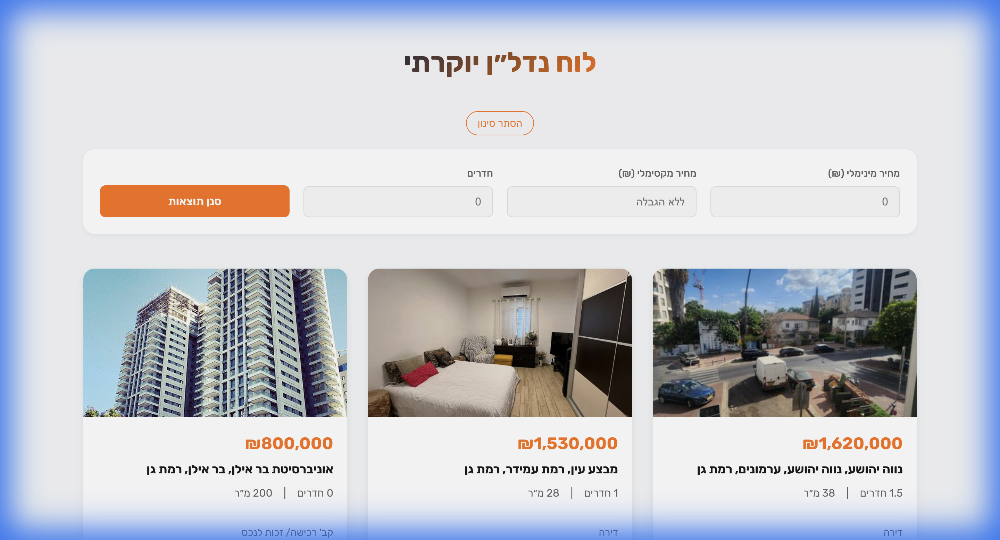

# Scarpe Yad2 - Real Estate Board

A premium, localized (Hebrew/RTL) real estate listing application built with React, Vite, and TypeScript.



## Features

- **Modern Premium Design**: Clean UI with a focus on readability and visual appeal.
- **RTL Support**: Fully localized for Hebrew speakers with Right-to-Left layout.
- **Image Carousel**: View multiple property photos with an interactive slider.
- **Interactive Map**: Built-in OpenStreetMap view to see exact property location.
- **Advanced Filtering**: Filter properties by price, bedrooms, and bathrooms.
- **Favorites System**: Mark properties as favorites or hide them from the list.
- **Responsive Layout**: Works seamlessly on desktop and mobile devices.

## Tech Stack

- **Framework**: React 19 + Vite
- **Language**: TypeScript
- **Styling**: CSS Modules / CSS Variables
- **Linting**: ESLint

## Getting Started

1. **Install Dependencies**
   ```bash
   npm install
   ```

2. **Run Development Server**
   ```bash
   npm run dev
   ```

3. **Build for Production**
   ```bash
   npm run build
   ```

## License

Private project.